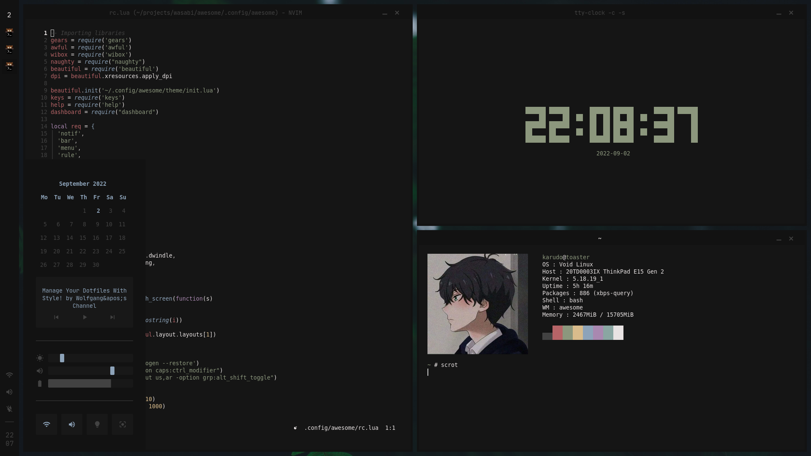

<h1 align="center">Wasabi 🍣</h1>
<p align="center">
  
  
  
</p>



## Setup
- Install the dependencies
```
awesome-git firefox wezterm mpv neofetch neovim rofi tmux zathura stow redshift nitrogen pulseaudio alsa-plugins-pulseaudio flameshot brightnessctl NetworkManager
```

- Link the dotfiles
```sh
$ git clone https://github.com/itskarudo/wasabi --recurse-submodules
$ cd wasabi
$ stow awesome bash wezterm mpv neofetch neovim rofi scripts tmux zathura
```

- Enable the firefox theme (optional)
  - type `about:config` in the searchbar
  - Search for `toolkit.legacyUserProfileCustomizations.stylesheet`, `layers.acceleration.force-enabled`, `gfx.webrender.all` and `svg.context-properties.content.enabled` and set them to `True`
  - Move the `firefox/chrome` folder into your firefox profile directory
  - Reload firefox

## Special thanks
- [Manas140 dotfiles](https://github.com/Manas140/dotfiles)
- [saimoomedits dotfiles](https://github.com/saimoomedits/dotfiles)
- [SimpleFox](https://github.com/migueravila/SimpleFox)
